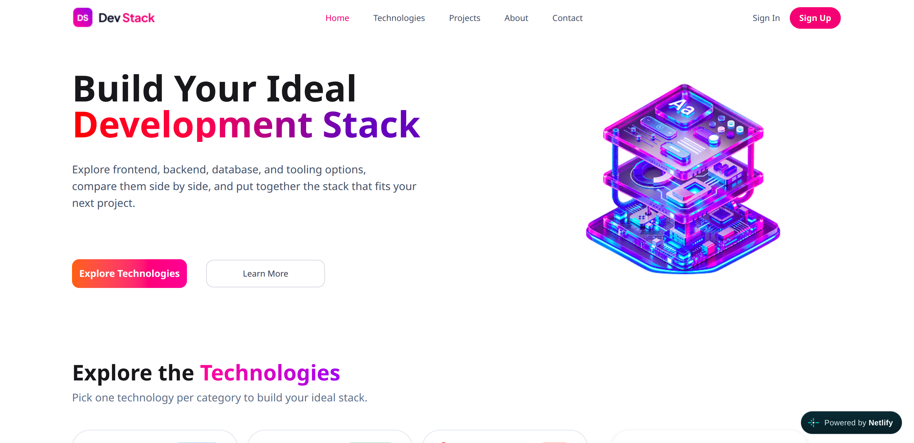

# 💻 Dev Stack — Technology & Skill Explorer

Dev Stack is a modern and responsive web application that showcases different web development technologies and programming skills.

Users can explore various technologies, view their categories, descriptions, ratings, difficulty levels, and other useful information through an interactive card-based interface.

The application is designed to provide a clean and user-friendly experience across **mobile, tablet, and desktop devices**.

---

## 🚀 Live Project

### 🌐 Live Website

https://my-firsht-dev-stack-project.netlify.app/

### 📦 GitHub Repository

https://github.com/shahidul91325/dev-stack-web

---

## 📸 Project Preview



---

# 📌 BASIC QUESTIONS

## 1. Q/ Name of the Project

### 1. A/ Dev Stack

---

## 2. Q/ A Little Description

### 2. A/

Dev Stack is a modern and responsive web application that showcases different web development technologies and programming skills.

Users can explore technologies, view their categories, descriptions, ratings, difficulty levels, and other useful information through an interactive card-based interface.

The project is built with reusable React components and a responsive layout so that it works smoothly across mobile, tablet, and desktop devices.

---

## 3. Q/ Technologies Used

### 3. A/

* **React.js**
* **TypeScript**
* **Tailwind CSS**
* **React Icons**
* **React Toastify**
* **Vite**
* **DaisyUI**
* **JSON** for local data management

---

## 4. Q/ Three Features

### 4. A/

### 1. Technology Skill Cards

Displays different technologies with their:

* Logos
* Descriptions
* Categories
* Ratings
* Difficulty levels

### 2. Responsive Design

The website is fully responsive and provides a clean user experience across:

* 📱 Mobile
* 📲 Tablet
* 💻 Desktop

### 3. Dynamic Data Rendering

Technology information is stored in data and dynamically displayed using React components and `.map()`.

This makes the application easier to maintain and extend when adding new technologies.

---

# ✨ Main Features

* 🧑‍💻 Explore different web development technologies
* 🏷️ Filter technologies by category
* ⭐ View technology ratings
* 📊 View difficulty levels
* 📖 Read technology descriptions
* ➕ Add skills to your personal stack
* ❌ Remove skills from your stack
* 🔄 Dynamically render technology cards
* 📱 Fully responsive design
* 🔔 Toast notifications
* 🎨 Modern UI with Tailwind CSS and DaisyUI

---

# 🛠️ Technologies & Tools

| Technology     | Purpose                             |
| -------------- | ----------------------------------- |
| React.js       | Building the user interface         |
| TypeScript     | Type-safe development               |
| Tailwind CSS   | Styling and responsive design       |
| DaisyUI        | UI components and styling utilities |
| React Icons    | Icons throughout the application    |
| React Toastify | Toast notifications                 |
| Vite           | Development server and build tool   |
| JSON           | Local technology/skill data         |
| Git & GitHub   | Version control                     |

---

# 📦 Dependencies

### Main Dependencies

* `@tailwindcss/vite`
* `react`
* `react-dom`
* `react-icons`
* `react-toastify`
* `tailwindcss`
* `daisyui`

### Development Dependencies

* `@eslint/js`
* `@types/node`
* `@types/react`
* `@types/react-dom`
* `@vitejs/plugin-react`
* `eslint`
* `eslint-plugin-react-hooks`
* `eslint-plugin-react-refresh`
* `globals`
* `typescript`
* `typescript-eslint`
* `vite`

---

# ⚛️ REACT CORE QUESTIONS

## 1. Q/ What is JSX, and why is it used in React?

### 1. A/

JSX stands for **JavaScript XML**.

It allows us to write HTML-like syntax inside JavaScript or TypeScript.

JSX makes React components easier to read and allows developers to describe the structure of the UI directly inside JavaScript or TypeScript code.

Example:

```tsx
const App = () => {
  return <h1>Welcome to Dev Stack</h1>;
};
```

---

## 2. Q/ What is the difference between props and state?

### 2. A/

Props and state are both used to handle data in React, but they have different purposes.

### Props

1. Props are used to pass data from a parent component to a child component.
2. Props are read-only.
3. A child component should not directly change its props.
4. Props help make components reusable.

### State

1. State is data that belongs to a component.
2. State can change during the application's execution.
3. When state changes, React re-renders the component.
4. State can be managed using React hooks such as `useState`.

---

## 3. Q/ What does the useState hook do, and where did you use it in this project?

### 3. A/

The `useState` hook allows a React functional component to create and manage state.

In my **Dev Stack** project, I used `useState` to manage interactive data such as the selected technologies/skills in my personal stack.

For example, when a user adds a technology to their stack, the state is updated and React automatically updates the UI.

```tsx
const [selectedSkills, setSelectedSkills] = useState([]);
```

---

## 4. Q/ What does the useEffect hook do, and why did you need it to load the JSON data?

### 4. A/

The `useEffect` hook is used to perform **side effects** in a React component.

I used `useEffect` to perform the data-loading operation when the component is rendered.

It allows the application to load the technology/skill data after the component has mounted.

Example:

```tsx
useEffect(() => {
  // Load technology data
}, []);
```

The empty dependency array `[]` means the effect runs after the component's initial render.

---

## 5. Q/ Why does every item in a .map() list need a unique key prop?

### 5. A/

When we use `.map()` to create multiple React elements, each element should have a unique `key` prop.

The key should be unique among the items in that list.

React uses the key to identify which items have changed, been added, or been removed. This helps React update the UI efficiently.

Example:

```tsx
skills.map((skill) => (
  <SkillCard
    key={skill.id}
    skill={skill}
  />
))
```

Here, `skill.id` is used as the unique key.

---

## 6. Q/ What is conditional rendering? Show one place you used it.

### 6. A/

Conditional rendering means displaying different UI depending on a condition.

For example, if there are no skills in my stack, I can display an empty message.

```tsx
{selectedSkills.length === 0 ? (
  <p>Your stack is empty.</p>
) : (
  <SkillList skills={selectedSkills} />
)}
```

Here, React displays different content depending on whether `selectedSkills` is empty or contains skills.

Therefore, conditional rendering allows React to show different content based on a condition.

---

## 7. Q/ How do you pass data from a parent component to a child component, and how does a child send something back to the parent?

### 7. A/

We pass data from a parent component to a child component using **props**.

For example:

```tsx
<SkillCard
  skill={skill}
/>
```

Here, the parent component passes the `skill` data to the `SkillCard` child component through props.

A child component cannot directly change the parent's state.

Instead, the parent can pass a **callback function** to the child.

Example:

```tsx
<SkillCard
  skill={skill}
  onAdd={handleAddSkill}
/>
```

The child component can call `onAdd()` when the user performs an action.

This allows the child component to communicate with the parent while keeping the state controlled by the parent component.

---

# 📱 Responsive Design

Dev Stack is designed and optimized for different screen sizes.

### 📱 Mobile

The layout adapts to smaller screens with responsive navigation, cards, spacing, and content.

### 📲 Tablet

The UI adjusts the number of columns, spacing, and component sizes for tablet screens.

### 💻 Desktop

The application uses the available
